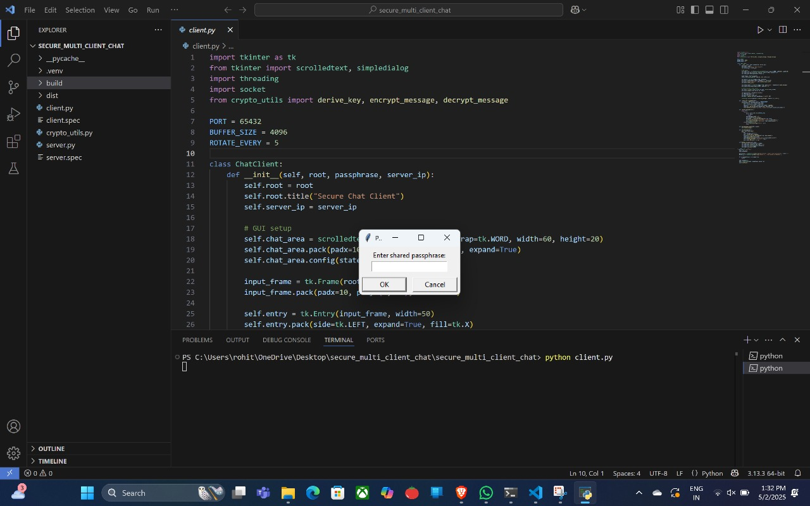
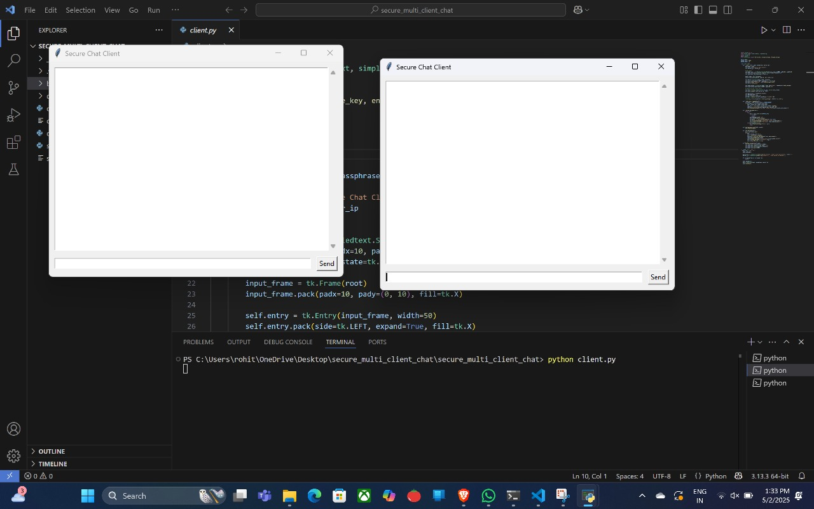

# 🔐 Secure Multi-Client Chat Application

This project implements a secure peer-to-peer messaging system where multiple clients can connect to a central server and exchange encrypted messages. It uses AES encryption, key rotation, and a shared passphrase for confidentiality.

## 📦 Features

- End-to-end encrypted chat using AES-256
- Key derivation using PBKDF2
- Automatic key rotation after N messages
- Support for multiple clients via threaded server
- Tkinter-based GUI for easy message exchange
- Can be compiled into `.exe` using PyInstaller

---

## 🛠 Installation

### 1. Clone the repo
```bash
git clone https://github.com/yourusername/secure-chat.git
cd secure-chat
```

### 2. Install required dependencies
```bash
pip install cryptography
```

### 3. (Optional) Build `.exe` for distribution
```bash
pip install pyinstaller
pyinstaller --onefile --noconsole client.py
```

---

## 🚀 How to Use

### 🔹 Start the Server (on one device)
```bash
python server.py
```

### 🔹 Run the Client (on other devices)
```bash
python client.py
```

When prompted:
- Enter the **shared passphrase**
- Enter the **server's IP address**

> 💡 If both devices are on the same Wi-Fi, use the server's **local IP** (e.g., `192.168.x.x`)

---

## 🧪 Example Screenshots






---

## 🔐 Security Notes

- Uses AES-CBC with PKCS7 padding
- Key is derived from passphrase using PBKDF2 with salt
- Keys rotate every 5 messages to improve forward secrecy
- Messages are never stored on the server; it acts as a blind relay

---

## 📁 Folder Structure

```
secure-chat/
├── client.py          # Client GUI
├── server.py          # Multi-threaded server
├── crypto_utils.py    # Encryption functions
├── README.md
├── .gitignore
```

---

## 🧑‍💻 Author

**Sai Chaitanya Gelivi**  
Graduate Student @ University of Oklahoma


